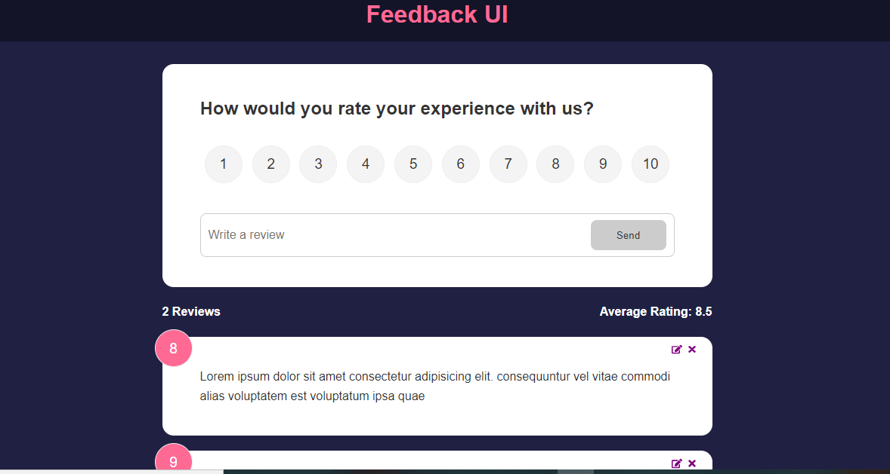

# Getting Started with Create React App

This project was bootstrapped with [Create React App](https://github.com/facebook/create-react-app).

## Table of contents

- [Overview](#overview)
  - [Screenshot](#screenshot)
  - [Links](#links)
  - [Built with](#built-with)
  - [What I learned](#what-i-learned)
  - [Challenge](#challenge)
  -[Resources](#resources)
- [Author](#author)

## Overview
This is a feedback app that can be used for a product or service.
### Screenshot

### Links

- Solution URL: [https://github.com/PrincessMaggy/feedback-app.git]
- Live Site URL: [https://princessmaggy.github.io/feedback-app]

### Built with

- React
- Styled Components
- Framer motion

### What I learned
- I got better understanding of how to post, get and put data in a json file.
- I also learnt how to apply React useContext for gloabl state and methods.

### Challenge
- I'm yet to figure out how to load the data from the json file (database.json) while hosting the application on github pages.
### Resources
[udemy](https://www.udemy.com/course/react-front-to-back-2022/learn/lecture/29768200#questions/16462688)

## Author

- Website - [Maggy](https://princessmaggy.github.io/My-Portfolio/)
- Frontend Mentor - [@Maggy](https://www.frontendmentor.io/profile/princessmaggy)
- Twitter - [@princessMaggy7](https://www.twitter.com/princessMaggy7)

